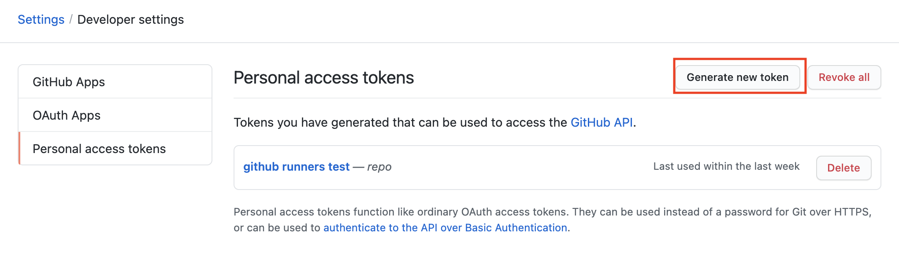
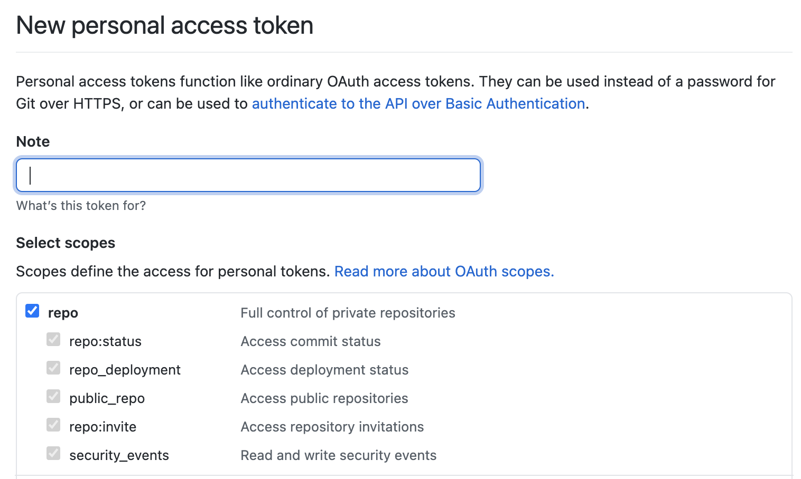

# github-actions-runner-aws

## About

This repository contains Dockerfiles for self-hosted GitHub Actions runners and an associated Terraform module which can be run in your environment to provision:

- ECS Cluster
- ECS Service
- ECS Fargate task definition to spin up an instance of this runner _per job_ in your GitHub Actions workflow

This module uses an existing ECR repository in AWS, and so does not provision one.

## Runner Dockerfiles

- `latest.Dockerfile`: A minimal runner image based on Ubuntu. Reference this image with the `latest` image tag
- `playwright.Dockerfile`: An image using the [`playwright:focal` base image](https://mcr.microsoft.com/en-us/product/playwright/about) for Playwright dependencies. Reference this image with the `playwright` image tag

To build the Dockerfiles locally, you must first export the `ACTIONS_VERSION` environment variable, then tell Docker to take the `ACTIONS_VERSION` build argument from the environment, like so:

```bash
export $(cat docker.env) && docker build -f latest.Dockerfile --build-arg ACTIONS_VERSION -t local-latest .

```

## Set Up

See [Confluence](https://confluenceent.cms.gov/display/MDSO/Guide+to+Github+Actions+Self-Hosted+Runners) for the most up-to-date setup steps

### IAM Permissions

There is a sub-directory containing a separate module that configures the resources necessary to use GitHub's OIDC provider to retrieve short-term credentials from AWS. See [the module's README](github-oidc/README.md) for more information.

#### NOTE: Including a path to IAM roles

Should you decide to populate the optional `path` variable in this module, ensure that the Resource the iam:GetRole and PassRole are enabled on includes the path you specify. e.g. `"arn:aws:iam::$AWS_ACCOUNT_ID:role/path/you/specified/ecs-task-role-*"`

## Local Github Token Testing

This is strictly for testing purposes. These steps help test a Github token by running the docker image and enabling you to manually trigger the `entrypoint.sh` script locally via Docker. This does not require any AWS infrastructure deployed.

The `entrypoint.sh` script is what sets up the docker image to act as a runner, including registration with the repository specified.

1. Clone this repository to your machine.
2. Ensure your environment variables are populated:
   - `PERSONAL_ACCESS_TOKEN` - Your GitHub personal access token with repository permissions.
     - Go to Settings > Developer Settings > Personal Access Token, and click on **Generate new token**
       
     - Give your token a note and check the box to give full control of private repositories
       
     - Once generated, be sure to save your token in a secure location such as 1pass or AWS Secrets Manager
   - `REPO_OWNER` - The name of the repository owner, e.g. `Enterprise-CMCS`
   - `REPO_NAME` - The name of the repository you are configuring the runners for
3. Build and run the image. `./entrypoint.sh` should register the runner with your repository and start listening for jobs.
4. In one of the workflows in the target repository, change the `runs-on` value to `self-hosted`. This will make the workflow use the registered self-hosted runner to complete its task, after which it will shut down.

## Terraform Module

This repository contains a Terraform module to deploy an ECS cluster, ECS service, and log to Cloudwatch in support of automating the deployment of ephemeral self-hosted Github Actions runners within AWS.

This module supports the following features:

- Optionally pass an existing ECS Cluster, and if not, create one
- Set default desired count for ECS Service (default is 0, assuming it will be managed by Github Actions workflow)

### Usage

```hcl
module "github-actions-runner-aws" {
  source = "github.com/cmsgov/github-actions-runner-aws?ref=v2.0.0"

  # ECS variables
  environment               = "${environment}"
  ecs_vpc_id                = "${vpc.id}"
  ecs_subnet_ids            = "${vpc.private_subnets.id}"

  # GitHub Runner variables
  personal_access_token_arn = "${secretsmanager.token.arn}"
  github_repo_name          = "${repo_name}"
  ecr_repo_tag              = # "latest"/"playwright"
}
```

### Data Sources

Some existing variable information can be looked-up in AWS via data sources. For example:

```hcl
data "aws_secretsmanager_secret_version" "token" {
  secret_id = "/github-runner-dev/token"
}
```

Will let you then use the ARN of that data source in this way:

```hcl
personal_access_token_arn = data.aws_secretsmanager_secret_version.token.arn
```

### Required Parameters

| Name                      | Description                                             |
| ------------------------- | ------------------------------------------------------- |
| environment               | Environment name (used in naming resources)             |
| ecs_vpc_id                | VPC ID to be used by ECS                                |
| ecs_subnet_ids            | Subnet IDs for the ECS tasks.                           |
| personal_access_token_arn | AWS SecretsManager ARN for GitHub personal access token |
| github_repo_name          | The Github repository name                              |

### Optional Parameters

| Name                     | Default Value     | Description                                                                                                                                                              |
| ------------------------ | ----------------- | ------------------------------------------------------------------------------------------------------------------------------------------------------------------------ |
| cloudwatch_log_retention | 731               | Number of days to retain Cloudwatch logs                                                                                                                                 |
| ecr_repo_tag             | "latest"          | The tag to identify and pull the image in ECR repo                                                                                                                       |
| ecs_desired_count        | 0                 | Sets the default desired count for task definitions within the ECS service                                                                                               |
| assign_public_ip         | "false"           | Choose whether to assign a public IP address to the Elastic Network Interface                                                                                            |
| role_path                | "/"               | The path in which to create the assume roles and policies. Refer to [the AWS docs](https://docs.aws.amazon.com/IAM/latest/UserGuide/reference_identifiers.html) for more |
| permissions_boundary     | ""                | ARN of the policy that is used to set the permissions boundary for the role                                                                                              |
| github_repo_owner        | "Enterprise-CMCS" | The name of the Github repo owner                                                                                                                                        |
| tags                     | {}                | Additional tags to apply                                                                                                                                                 |
| runner_labels            | ""                | A comma-separated list of labels to apply to the runner                                                                                                                                            |

### Outputs

See `outputs.tf`

### Requirements

| Name      | Version |
| --------- | ------- |
| terraform | >= 0.13 |
| aws       | >= 3.0  |

### Modules

None.
