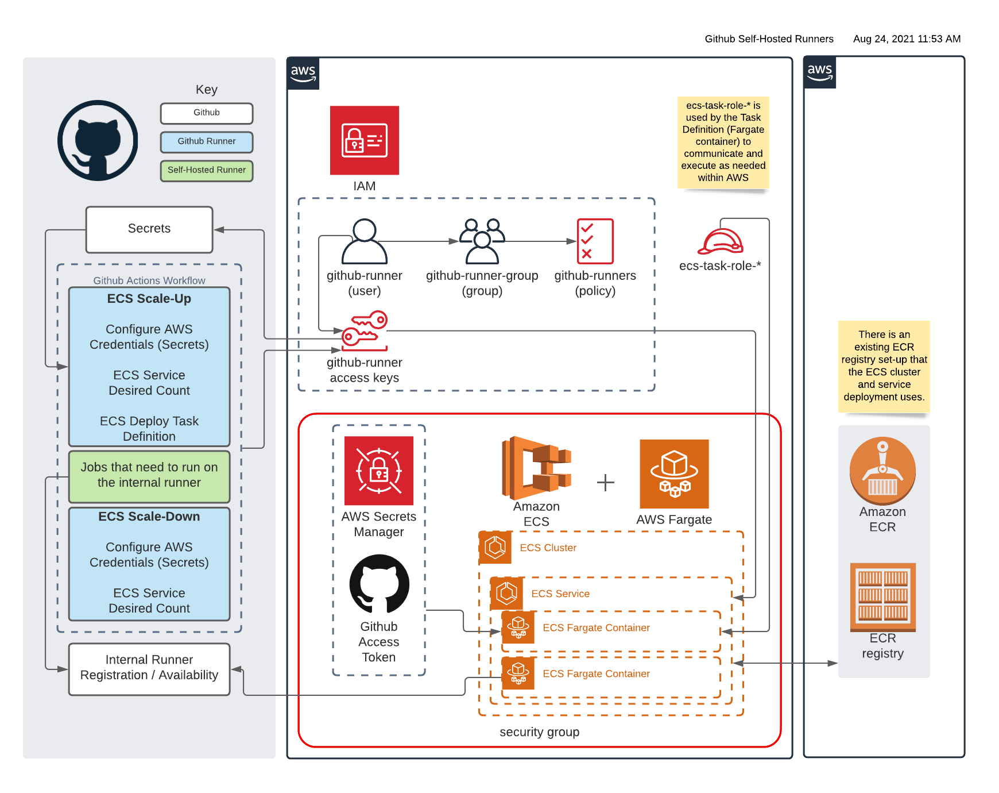

# github-actions-runner-aws

## About

This repository contains the Dockerfile for a self-hosted GitHub Actions runner and an associated Terraform module which can be run in your environment to provision:

* An ECR repository to which you can push images of your runner
* An ECS cluster and ECS Fargate task definition to spin up an instance of this runner *per job* in your GitHub Actions workflow.



## Set Up

1. Fork this repository.
2. Set up an IAM user in AWS with the necessary permissions to support the docker-build.yml workflow script included. See `IAM User Permissions` section below for details.
    * Once you have your user, be sure to populate your repository secrets with its access keys
    * Refer to the [docs](docs) for past ADRs regarding the IAM user and GitHub actions workflow considerations. In particular, you will need to manually change your ECR repository name.
3. Provision the Terraform module in this repository.
4. You should now be able to push images to your ECR repository via a push to your main branch or a new release. An ECS Cluster and Service should also be set up for you.
5. See the [documentation](Usage.md) on usage of the runner on how to deploy runners to your service.

### IAM User Permissions

Creation of the IAM user, group, and attached policy should be submitted via [CMS Jira](https://jiraent.cms.gov/) to the Cloud Support team.

For the IAM user needed for Github to interact with AWS (specifically ECR and ECS), the username should be `github-runner` and the user should be a part of the group `github-runner-group`. The permissions policy should be attached to that group `github-runner-group` to follow [best practices](https://docs.aws.amazon.com/IAM/latest/UserGuide/best-practices.html#use-groups-for-permissions).

`$AWS_ACCOUNT_ID` and `$AWS_REGION` in the IAM policy should be updated to be the appropriate account ID and region for your deployment.

All of the specified resources in the IAM policy do not have to exist prior to the policy being created.

`github-runners` IAM policy:

```text
{
    "Version": "2012-10-17",
    "Statement": [
        {
            "Sid": "IAMActions",
            "Effect": "Allow",
            "Action": [
                "iam:GetRole",
                "iam:PassRole"
            ],
            "Resource": "arn:aws:iam::$AWS_ACCOUNT_ID:role/ecs-task-role-*"
        },
        {
            "Sid": "ECRTokenAndECSTaskActions",
            "Effect": "Allow",
            "Action": [
                "ecs:RegisterTaskDefinition",
                "ecr:GetAuthorizationToken",
                "ecs:DescribeTaskDefinition"
            ],
            "Resource": "*"
        },
        {
            "Sid": "ECRRepositoriesActions",
            "Effect": "Allow",
            "Action": [
                "ecr:CompleteLayerUpload",
                "ecr:DescribeRepositories",
                "ecr:ListImages",
                "ecr:DescribeImages",
                "ecr:GetDownloadUrlForLayer",
                "ecr:GetLifecyclePolicy",
                "ecr:InitiateLayerUpload",
                "ecr:PutImage",
                "ecr:UploadLayerPart"
            ],
            "Resource": "arn:aws:ecr:$AWS_REGION:$AWS_ACCOUNT_ID:repository/github-runner"
        },
        {
            "Sid": "ECSClusterActions",
            "Effect": "Allow",
            "Action": [
                "ecs:DescribeServices",
                "ecs:UpdateService"
            ],
            "Resource": [
                "arn:aws:ecs:$AWS_REGION:$AWS_ACCOUNT_ID:cluster/github-runner",
                "arn:aws:ecs:$AWS_REGION:$AWS_ACCOUNT_ID:service/github-runner/github-actions-runner"
            ]
        }
    ]
}
```

## Terraform Deployment

Here is an example of how you would use the module in your own terraform deployment:

```text
module "github-actions-runner-aws" {
  source = "github.com/cmsgov/github-actions-runner-aws?ref=v1.0.0"

  # ECR variables
  container_name          = "github-runner"
  allowed_read_principals = local.principals_ro_access
  ci_user_arn             = data.aws_iam_user.github_ci_user.arn

  # ECS variables
  environment               = "dev"
  ecs_desired_count         = 0
  ecs_vpc_id                = data.aws_vpc.example_east_sandbox.id
  ecs_subnet_ids            = data.aws_subnet_ids.private.ids
  ecr_repo_tag              = "latest"
  logs_cloudwatch_group_arn = aws_cloudwatch_log_group.main.arn

  # GitHub Runner variables
  personal_access_token_arn = data.aws_secretsmanager_secret_version.token.arn
  github_repo_owner         = "org-name"
  github_repo_name          = "repo-name"
}
```

## Local Usage

1. Clone this repository to your machine.
2. Ensure your environment variables are populated:
    * `PERSONAL_ACCESS_TOKEN` - Your github personal access token with repository permissions.
        * Go to Settings > Developer Settings > Personal Access Token, and click on **Generate new token**
        
        * Give your token a note and check the box to give full control of private repositories
        
        * Once generated, be sure to save your token in a secure location such as 1pass or AWS Secrets Manager
    * `REPO_OWNER` - The name of the repository owner, e.g. `CMSgov`
    * `REPO_NAME` - The name of the repository
3. Build and run the image. `./entrypoint.sh` should register the runner with your repository and start listening for jobs.
4. In one of the workflows in the target repository, change the `runs-on` value to `self-hosted`. This will make the workflow use the registered self-hosted runner to complete its task, after which it will shut down.
